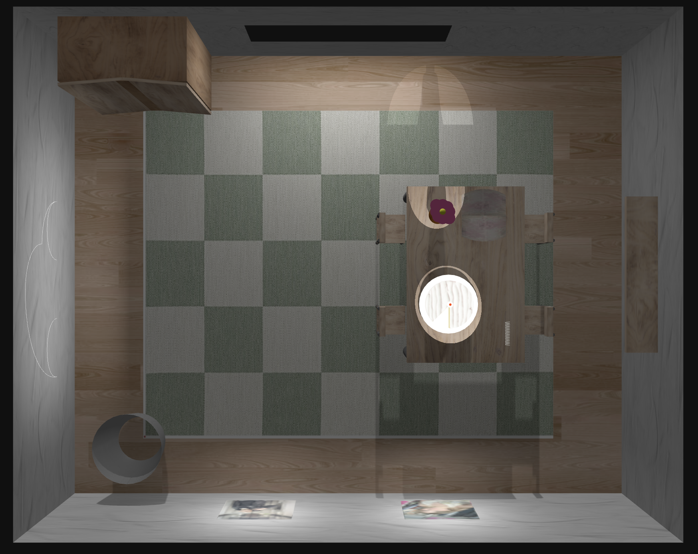
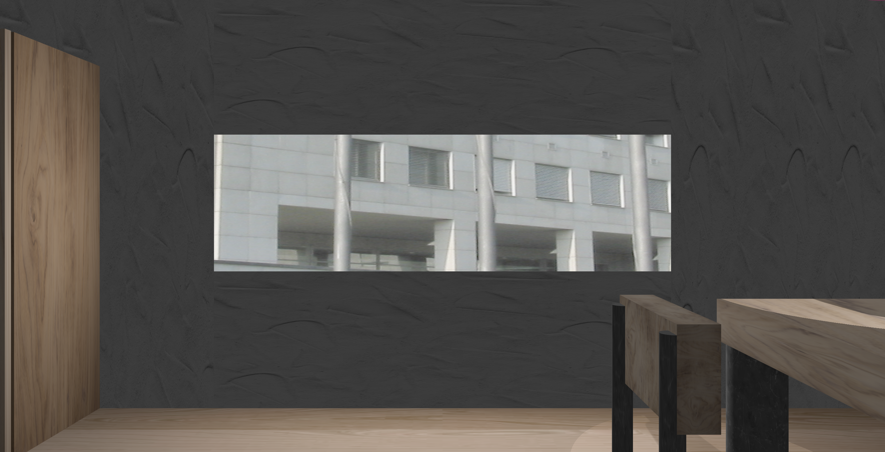

# SGI 2024/2025 - TP1

## Group T01G06
| Name             | Number    | E-Mail             |
| ---------------- | --------- | ------------------ |
| Miguel Aréjula Aísa        | 202402361 | up2024023621@up.pt               |
| Bianca Martins Simões de Olievira| 202000139 | up202000139@up.pt               |

----
## Project information
The main goal of this project is to undersand the basics of Three.js and how to create a 3D scene. We designed a room with various light sources, textures, cameras and geometric shapes. Additionally, we create a GUI which lets the user modify the values of different attributes.
### Scene
The scene create represents a room with all the required objects. In addition, we create:
 - A rubbish bin
 - A carpet
 - Directional light coming from the window
 - Two point lights for each picture
 - A point light illuminating a beetle model
 - Four chairs
 - Two cameras focusing on each picture
 - A camera focused on the beetle
 - A GUI to modify the attributes of the cameras and lights
 - A spotlight highlighting a flower and jar
 - A rectangle light simulating the light coming from the window
 - A camera focusing on the table
 - A camera from the corner of the room
 - A camera focusing the window

 ### Screenshots
- Inital view

- Corner view

- Window view

 
----
## Issues/Problems

- We try to use the rectangle light to recreate the light from the window, however, the rectangle light does not support shadows. We like the effect of this light in the scene, so we decide to keep it and add a directional light to create the shadows. 
- The GUI controls for the camera only works for the first camera. We try to fix it but we were not able to do it. We try to create a new GUI for the second camera, but it did not work.