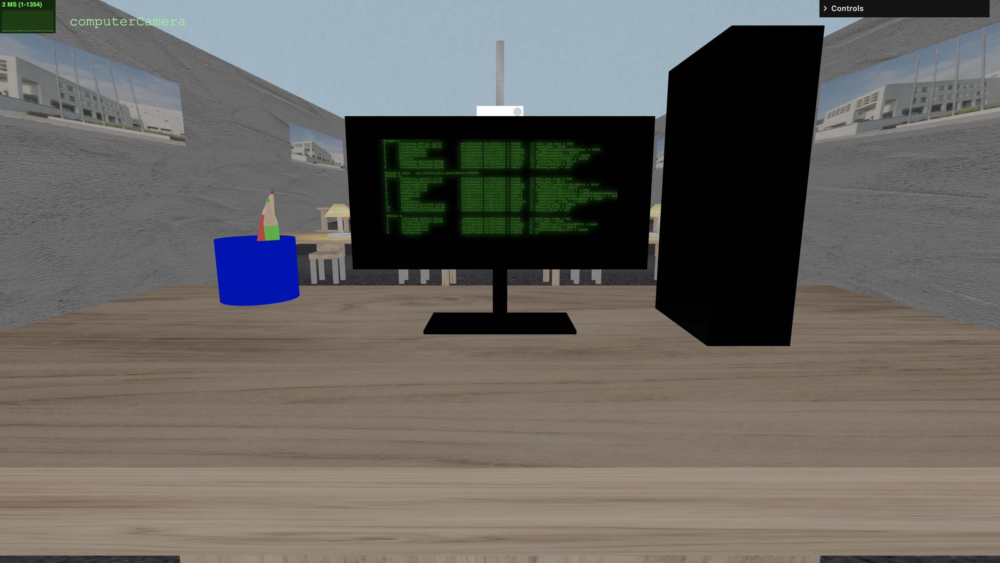
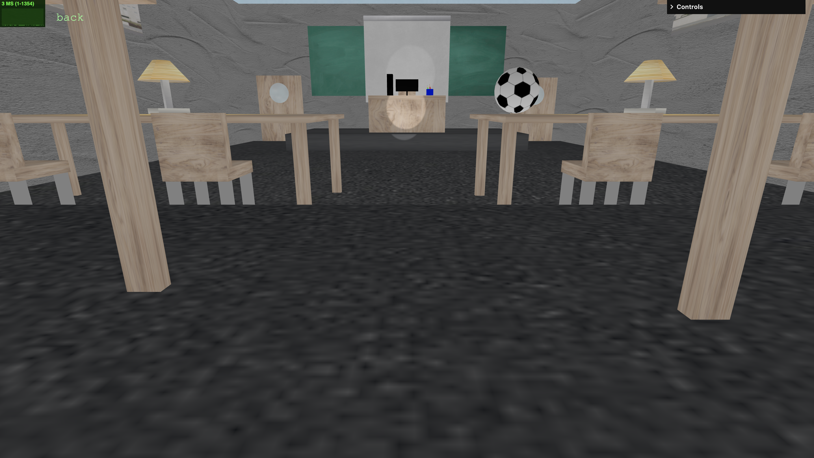

# SGI 2024/2025 - TP2

## Group: T01G06

| Name             | Number    | E-Mail             |
| ---------------- | --------- | ------------------ |
| Miguel Aréjula Aísa        | 202402361 | up2024023621@up.pt               |
| Bianca Martins Simões de Olievira| 202000139 | up202000139@up.pt               |

----
## Project information

In this project we have defined a scene of a classroom using a JSON file. The language used was YASF. We also made a parser which reads the JSON file and creates the scene in Three.js.
#### Scene: Classroom
This scene represents a classroom. To model the scene, we have based it on a class at the University of Zaragoza. This scene has a blackboard, a whiteboard a teacher's desk, a computer, a glass, two pencils, tables, chairs, lamps, windows,  doors, a floor and walls.
### Features made
- Buffer Geometry
- Video textures (on the computer screen)
- Skybox
- Level of Detail (present)
### Screenshots

----
## Issues/Problems

- At the beginning, we had some problems with the parser, but we managed to solve them. Also, when the YASF definition was changed it made us have to change the parser.
- The video could not be uploaded to github. You could dowload the zip to get it.
