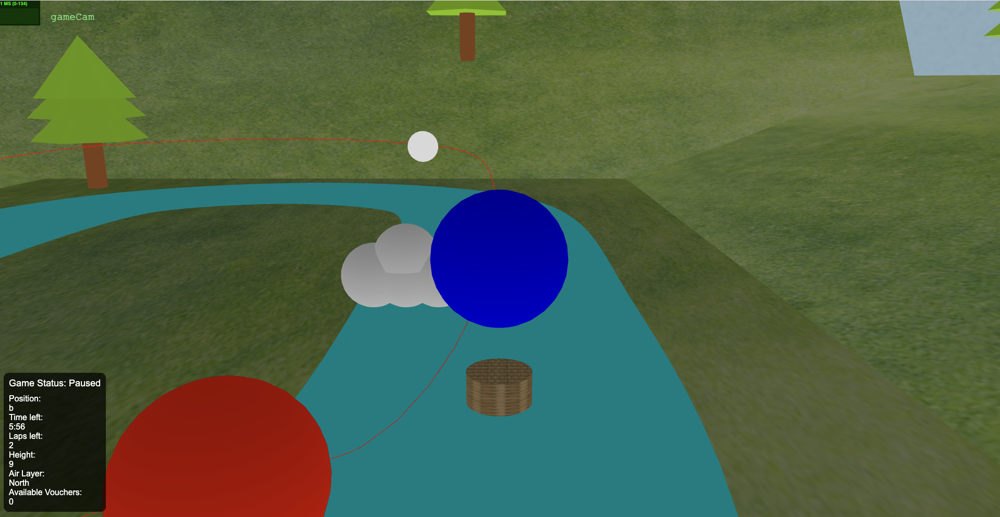
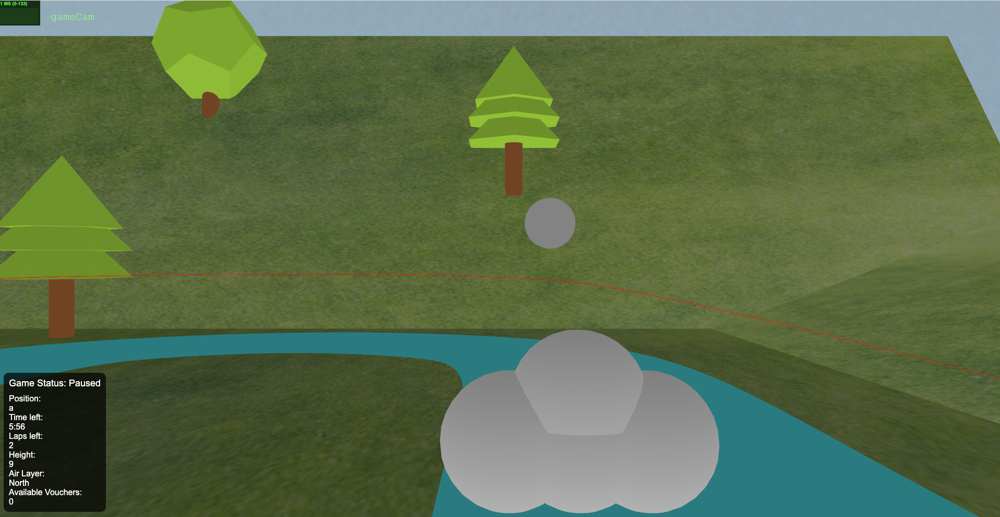

# SGI 2024/2025 - TP3

## Group: T01G06

| Name             | Number    | E-Mail             |
| ---------------- | --------- | ------------------ |
| Miguel Aréjula Aísa        | 202402361 | up2024023621@up.pt               |
| Bianca Martins Simões de Olievira| 202000139 | up202000139@up.pt               |

----
## Project information

In this project we had created a game with threeJS. The game consists of a hot air balloon race. The player has to beat the enemy hot air in a race. There are obstacles in the way that the player has to avoid and power-ups that the player can collect to get an advantage. The game has a time limit and the player has to reach the end of the track before the time runs out. There are two cameras, one first person and one third person. The player can switch between the two cameras, pressing the 'C' key. The player can also pause the game by pressing the 'space' key and end the game with the 'esc' key.   

### Features made
- Game elements
  - Hot air balloon
  - Enemy hot air balloon
  - Obstacles
  - Power-ups
  - Outdoors display
  - Scenario
  - Track
- Cameras
  - First person
  - Third person
- Techniques
  - Collision detection
  - Time limit
  - Pause
  - End game
  - Switch cameras
  - Keyboard controls
  - Picking
  - KeyFrames animation
  - Off-track detection
  - Spritessheets 

### Screenshots

----
## Issues/Problems

- We organized so bad during the development of the project so we ran out of time to implement the game with more details, like more routes. 
-  We show a basic track, however, we had a second json with a harder track that we didn't have time to test and create routes.
